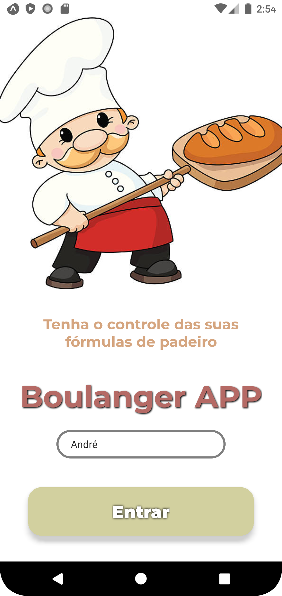

# :bread: Boulanger APP

## Tenha o controle de suas fórmulas de padeiro!

# :scroll: Uma breve descrição:

App desenvolvido para **auxiliar** pessoas que desenvolvem massas de pães e bolos, estudantes de panificação e confeitaria, além de qualquer pessoa que queira fazer produtos de panificação em casa com controle e praticidade.

---
O app está sendo desenvolvido para um projeto de pesquisa pelo IFRS-POA 

# :notebook_with_decorative_cover: Telas do aplicativo

---

## Para que serve o Boulanger APP?

A **função principal** do aplicativo é dar ao usuário a possibilidade de *__replicar uma receita para a quantidade que ele deseja__*. Na tela da receita de um determinado tipo de pão, o usuário pode escolher a _quantidade de pães_ que deseja fazer e o _peso de cada pão_ que deseja fazer, assim o programa calcula os ingredientes corretos para a receita escolhida!
- O programa oferece uma lista de receitas as quais o usuário pode selecionar uma receita de sua preferência;
- Dentro da tela da receita escolhida, o usuário recebe as informações de ingredientes da receita na quantidade e peso escolhidos;

#### Em breve mais features!